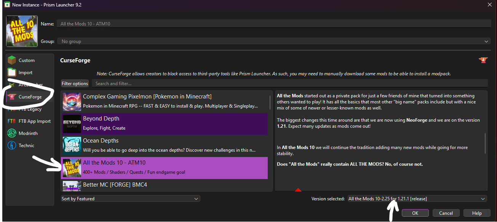
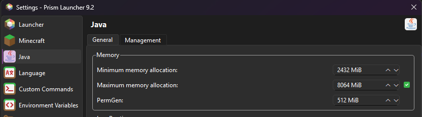

# Anleitung für den Community Minecraft Server

## Schritt 1: Prism Launcher herunterladen und installieren
1. Auf der [offizielle Prism Launcher Webseite](https://prismlauncher.org/) kannst du den Launcher runterladen.
2. Laden Sie die neueste Version des Prism Launchers für dein Betriebssystem herunter. Höchtwahrscheinlich der normale Installer .exe (ohne ARM)
3. Installieren den Prism Launcher, indem du den Anweisungen des Installationsprogramms folgen.

## Schritt 2: Minecraft-Instanz erstellen
1. Starten den Prism Launcher.
2. Füge deinen Microsoft Account auf dem du Minecraft hast.
3. Klicke auf "Instanz hinzufügen" oder "Neue Instanz".
4. Wähle exakt die Version wie auf dem Bild aus:

Wichtig ist vorallem die Version 10-2.25 ansonsten kannst du nicht dem Server beitreten.

5. Am Ende des Downloads wird Prism ca 10 Mods nicht automatisch runterladen können, diese musst du leider manuell einmal Aufrufen.
Der Download sollte aber beim Link automatisch ausgeführt werden und Prism checkt den Download Ordner von Windows im Hintergrund.

## Schritt 3: RAM-Einstellungen anpassen
1. Im Prism Launcher gehe auf Einstellungen.
2. Gehen zum Reiter "Java".
3. Passe die RAM-Einstellungen an, indem du den Schieberegler oder die Eingabefelder verwendest. Es wird empfohlen, mindestens 2 GB RAM zuzuweisen.
### Mein Beispiel:

## Schritt 4: Minecraft starten
1. Wähle die konfigurierte Minecraft-Instanz aus.
2. Klicke auf "Spielen" oder Doppelclick, um Minecraft zu starten.
3. In Minecraft unter Options.. ->  Video Settings.. -> General -> GUI Scale auf 2 oder nach belieben.
4. Im gleichen Screen oben auf Shader Packs.. einen auswählen, ich hab z.B. ComplementaryReimagined + EuphoriaPatches

Viel Spaß auf dem Server!